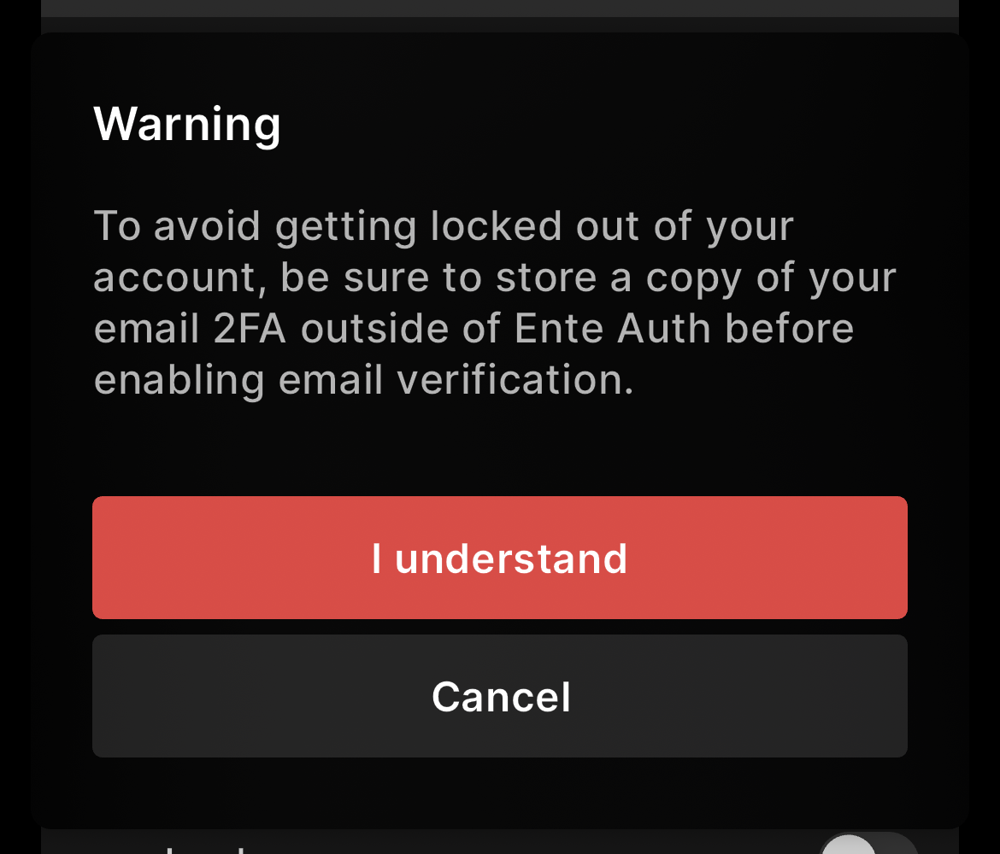

# Enteception

Your 2FA codes are in Ente Auth, but if you enable 2FA for your Ente account
itself, where should the 2FA for your Ente account be stored?

There are multiple answers, none of which are better or worse, they just depend
on your situation and risk tolerance.

If you are using the same account for both Ente Photos and Ente Auth and have
enabled 2FA from the ente Photos app, we recommend that you ensure you store
your recovery key in a safe place (writing it down on a paper is a good idea).
This key can be used to bypass Ente 2FA in case you are locked out.

Another option is to use a separate account for Ente Auth.

Also, taking exporting the encrypted backup is also another good way to reduce
the risk (you can easily import the encrypted backup without signing in).

Finally, we have on our roadmap some features like adding support for
emergency/legacy-contacts, passkeys, and hardware security keys. Beyond other
benefits, all of these would further reduce the risk of users getting locked out
of their accounts.

## Email verification for Ente Auth

There is a related ouroboros scenario where if email verification is enabled in
the Ente Auth app _and_ the 2FA for your email provider is stored in Ente Auth,
then you might need a code from your email to log into Ente Auth, but to log
into your email you needed the Auth code.

To prevent people from accidentally locking themselves out this way, email
verification is disabled by default in the auth app. We also try to show a
warning when you try to enable email verification in the auth app:

{width=400px}

The solution here are the same as the Ente-in-Ente case.

## TL;DR;

Ideally, you should **note down your recovery key in a safe place (may be on a
paper)**, using which you will be able to by-pass the two factor.
